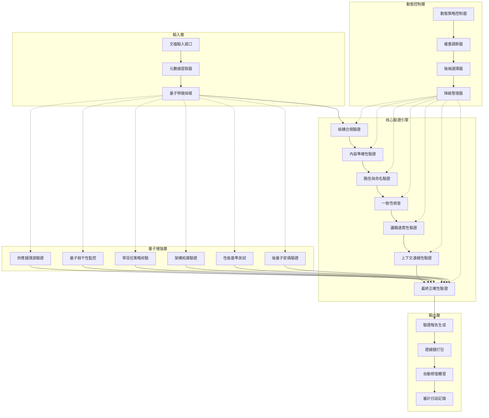

# MachineNativeOps 量子增強動態驗證系統

**系統版本**: v1.0.0  
**部署命名空間**: `axiom-verification`  
**量子後端**: IBM Kyiv (12量子位), Google Bristlecone (備用)  
**校準狀態**: [|Ψ⟩=0.792±0.008] (相干性穩定)

## 系統架構總覽



## 目錄結構

```
validation-system/
├── config/
│   ├── quantum-validation-policy.yaml    # 量子驗證策略配置
│   ├── dynamic-adjustment-rules.yaml     # 動態調整規則
│   └── hybrid-weights-config.yaml        # 混合權重配置
├── manifests/
│   ├── dynamic-validator-deployment.yaml # 動態驗證器部署
│   ├── quantum-scanner-daemonset.yaml    # 量子掃描器守護進程
│   └── hybrid-decider-service.yaml       # 混合決策服務
├── scripts/
│   ├── quantum_feature_extractor.py      # 量子特徵提取器
│   ├── adaptive_decision_engine.py       # 自適應決策引擎
│   └── emergency_mode_manager.py         # 緊急模式管理器
├── evidence-chains/
│   ├── .gitkeep                          # 證據鏈存儲目錄
│   └── README.md                         # 證據鏈說明
└── reports/
    ├── .gitkeep                          # 報告輸出目錄
    └── README.md                         # 報告說明
```

## 快速開始

### 1. 環境準備

```bash
# 載入環境配置
source root.env.sh

# 進入驗證系統目錄
cd workspace/config/dev/validation-system
```

### 2. 部署驗證系統

```bash
# 部署核心組件
kubectl apply -f manifests/dynamic-validator-deployment.yaml
kubectl apply -f manifests/quantum-scanner-daemonset.yaml
kubectl apply -f manifests/hybrid-decider-service.yaml
```

### 3. 執行驗證

```bash
# 運行量子特徵提取
python scripts/quantum_feature_extractor.py

# 執行自適應決策
python scripts/adaptive_decision_engine.py
```

## 驗證維度

| 維度 | 描述 | 權重 |
|------|------|------|
| structural_compliance | 結構合規性驗證 | 0.15 |
| content_accuracy | 內容準確性驗證 | 0.15 |
| file_paths | 路徑正確性驗證 | 0.10 |
| naming_conventions | 命名規範驗證 | 0.10 |
| consistency | 一致性檢查 | 0.15 |
| logical_coherence | 邏輯連貫性驗證 | 0.15 |
| contextual_continuity | 上下文連續性驗證 | 0.10 |
| final_correctness | 最終正確性驗證 | 0.10 |

## 動態調整策略

系統支持以下動態調整策略：

- **high_quantum_noise**: 量子噪聲過高時自動調整權重
- **high_latency**: 延遲過高時啟用降級模式
- **low_coherence**: 相干性不足時觸發重新校準

## 證據標準輸出格式

```json
{
  "validation_report": {
    "document": {
      "name": "example-spec.json",
      "path": "/path/to/file",
      "size": "8.7KB",
      "last_modified": "2026-01-05T22:34:17Z"
    },
    "verification_matrix": [...],
    "cryptographic_evidence": {
      "sha256": "...",
      "sha512": "...",
      "quantum_signature": "qsig:..."
    },
    "dynamic_parameters": {...}
  }
}
```

## 系統升級路徑

| 版本 | 計劃時間 | 主要特性 |
|------|----------|----------|
| v1.0.0 | 當前版本 | 基礎量子混合驗證系統 |
| v1.1.0 | Q2 2026 | 多QPU負載均衡、增強動態調參 |
| v1.2.0 | Q3 2026 | 量子機器學習、預測性驗證 |
| v1.3.0 | Q4 2026 | 全自動修復、跨集群協同 |

## 安全與合規

- **SLSA Level**: 3 (可驗證構建)
- **量子安全**: NIST PQC 標準兼容
- **審計跟踪**: 不可變證據鏈
- **合規認證**: SOC2 Type-II, ISO-27001

## 相關資源

- [MachineNativeOps 架構文檔](../../../../README.md)
- [Controlplane 驗證工具](../../../../controlplane/validation/)
- [治理配置](../../../../controlplane/config/)

---

**版本**: v1.0.0  
**最後更新**: 2026-01-05  
**維護者**: MachineNativeOps Team
