# 三階段系統重構執行計劃
# Three-Phase System Refactoring Execution Plan

> **執行標準 (Execution Standard)**: INSTANT Mode (< 3分鐘完整堆疊 / < 3 minutes full stack)  
> **自動化程度 (Automation Level)**: 100% (Zero Human Intervention at Operational Layer)  
> **治理合規 (Governance Compliance)**: Full AI Behavior Contract & SynergyMesh Core Compliance

---

## 📋 執行摘要 (Executive Summary)

本計劃提供一個系統化、可追溯、可回滾的三階段架構重構方案，專注於架構層面改造，不涉及業務邏輯變更。計劃遵循 INSTANT 執行標準，確保快速交付與完全自治。

**核心原則 (Core Principles)**:
- ✅ 架構重構優先 (Architecture-first refactoring)
- ✅ 自動化執行流程 (Automated execution workflows)
- ✅ 完整可追溯性 (Full traceability)
- ✅ 即時回滾能力 (Instant rollback capability)

---

## 🎯 全局優化視圖 (Global Optimization View)

### 優化目標 (Optimization Targets)

```yaml
global_metrics:
  architecture_compliance:
    current: "85%"
    target: "100%"
    improvement: "+15%"
    measure: "Percentage of modules following architecture skeleton rules"
    
  automation_coverage:
    current: "60%"
    target: "95%"
    improvement: "+35%"
    measure: "Percentage of refactoring tasks executable via automation"
    
  traceability_score:
    current: "70%"
    target: "100%"
    improvement: "+30%"
    measure: "Percentage of changes with full audit trail"
    
  rollback_readiness:
    current: "40%"
    target: "100%"
    improvement: "+60%"
    measure: "Percentage of changes with tested rollback procedures"
    
  execution_latency:
    current: "5-10 minutes per module"
    target: "< 3 minutes full stack"
    improvement: "70% reduction"
    measure: "Time from trigger to deployment"
```

### 硬性約束 (Hard Constraints)

```yaml
hard_constraints:
  - name: "No Business Logic Changes"
    rule: "Refactoring MUST NOT alter business functionality"
    validation: "Integration tests pass without modification"
    
  - name: "Architecture Layering"
    rule: "core/ MUST NOT depend on apps/ or services/"
    validation: "Dependency graph analysis shows unidirectional flow"
    
  - name: "Backward Compatibility"
    rule: "Public APIs MUST maintain backward compatibility"
    validation: "API contract tests pass for all versions"
    
  - name: "Zero Downtime"
    rule: "Refactoring MUST NOT cause service interruption"
    validation: "Health checks remain green throughout deployment"
    
  - name: "Governance Compliance"
    rule: "All changes MUST pass governance gates"
    validation: "AI Behavior Contract + SLSA + ISO compliance checks"
```

---

## 🏗️ 三階段流程概覽 (Three-Phase Process Overview)

```mermaid
graph TD
    A[Phase 1: Deconstruction<br/>解構階段] --> B[Phase 2: Integration<br/>集成階段]
    B --> C[Phase 3: Refactor<br/>重構階段]
    
    A1[分析現有架構] --> A
    A2[識別改進模組] --> A
    A3[繪製依賴關係] --> A
    
    B1[設計模組邊界] --> B
    B2[定義API契約] --> B
    B3[規劃整合策略] --> B
    
    C1[執行代碼重構] --> C
    C2[優化目錄結構] --> C
    C3[驗證與部署] --> C
    
    C --> D{Validation<br/>驗證}
    D -->|Pass| E[Complete<br/>完成]
    D -->|Fail| F[Rollback<br/>回滾]
    F --> A
```



---

## 📍 Phase 1: Deconstruction（解構階段）

### 目的 (Purpose)

分析和記錄現有系統架構，識別需要改進的模組和依賴關係。

### 具體執行步驟 (Detailed Execution Steps)

#### Step 1.1: 架構現狀盤點 (Architecture Inventory)

**時間 (Duration)**: 4-6 hours  
**負責代理 (Responsible Agent)**: analyzer-agent  
**並行度 (Parallelism)**: 16 agents  
**延遲目標 (Latency Target)**: ≤ 5 minutes

```yaml
actions:
  - action: "Scan repository structure"
    tool: "glob + grep"
    output: "workspace/docs/refactor_playbooks/01_deconstruction/repo_structure_map.yaml"
    
  - action: "Analyze module dependencies"
    tool: "dependency-cruiser / madge / custom scripts"
    output: "workspace/docs/refactor_playbooks/01_deconstruction/dependency_graph.json"
    
  - action: "Identify architecture violations"
    tool: "architecture-validator.py"
    output: "workspace/docs/refactor_playbooks/01_deconstruction/violations_report.md"
    
  - action: "Catalog legacy assets"
    tool: "legacy-asset-scanner.py"
    output: "workspace/docs/refactor_playbooks/01_deconstruction/legacy_assets_index.yaml"
```

**自動化腳本 (Automation Script)**:

```bash
#!/bin/bash
# scripts/phase1-deconstruction.sh

set -e

PHASE1_DIR="workspace/docs/refactor_playbooks/01_deconstruction"
mkdir -p "$PHASE1_DIR"

echo "🔍 Phase 1: Deconstruction - Starting..."

# 1.1 Repository Structure Mapping
echo "  → Mapping repository structure..."
python3 tools/refactor/map-repo-structure.py \
  --output "$PHASE1_DIR/repo_structure_map.yaml"

# 1.2 Dependency Analysis
echo "  → Analyzing dependencies..."
npx dependency-cruiser \
  --output-type json \
  --config .dependency-cruiser.js \
  . > "$PHASE1_DIR/dependency_graph.json"

# 1.3 Architecture Validation
echo "  → Validating architecture..."
python3 tools/refactor/validate-architecture.py \
  --config controlplane/config/architecture-rules.yaml \
  --output "$PHASE1_DIR/violations_report.md"

# 1.4 Legacy Asset Cataloging
echo "  → Cataloging legacy assets..."
python3 tools/refactor/catalog-legacy-assets.py \
  --scan-path . \
  --output "$PHASE1_DIR/legacy_assets_index.yaml"

echo "✅ Phase 1: Deconstruction - Complete"
```

#### Step 1.2: 問題識別與優先級排序 (Problem Identification & Prioritization)

**時間 (Duration)**: 2-3 hours  
**負責代理 (Responsible Agent)**: diagnostic-agent  
**並行度 (Parallelism)**: 8 agents  
**延遲目標 (Latency Target)**: ≤ 2 minutes

```yaml
problem_categories:
  P0_Critical:
    - "Circular dependencies"
    - "Architecture layer violations (apps → core)"
    - "Security vulnerabilities (HIGH severity)"
    - "Forbidden language usage (PHP, Perl)"
    
  P1_High:
    - "Language governance violations (mixed TS/JS)"
    - "Hotspot files (high change frequency + complexity)"
    - "Missing module boundaries"
    - "Inadequate test coverage (< 70%)"
    
  P2_Medium:
    - "Technical debt markers (TODO, FIXME)"
    - "Inconsistent naming conventions"
    - "Duplicate code patterns"
    - "Documentation gaps"

analysis_tools:
  - tool: "semgrep"
    purpose: "Security and code quality scanning"
    config: ".semgrep.yml"
    
  - tool: "eslint / tslint"
    purpose: "Language governance enforcement"
    config: ".eslintrc.js"
    
  - tool: "sonarqube"
    purpose: "Code smell and complexity analysis"
    config: "sonar-project.properties"
```

#### Step 1.3: 依賴關係圖繪製 (Dependency Relationship Mapping)

**時間 (Duration)**: 1-2 hours  
**負責代理 (Responsible Agent)**: graph-agent  
**並行度 (Parallelism)**: 4 agents  
**延遲目標 (Latency Target)**: ≤ 3 minutes

```yaml
deliverables:
  - name: "Module Dependency Graph"
    format: "Mermaid diagram + JSON"
    location: "workspace/docs/refactor_playbooks/01_deconstruction/core/dependency_graph.md"
    
  - name: "Layer Dependency Matrix"
    format: "YAML matrix"
    location: "workspace/docs/refactor_playbooks/01_deconstruction/layer_dependencies.yaml"
    
  - name: "Violation Hotspots"
    format: "Interactive HTML"
    location: "workspace/docs/refactor_playbooks/01_deconstruction/hotspots.html"

visualization_example: |
  ```mermaid
  graph TD
      Apps[apps/] --> Services[services/]
      Services --> Core[core/]
      Core --> Shared[shared/]
      
      Apps -.X.-> Core
      Services -.X.-> Shared
      
      style Apps fill:#e1f5ff
      style Services fill:#fff4e1
      style Core fill:#e8f5e9
      style Shared fill:#f3e5f5
  ```
```

### Phase 1 交付物 (Phase 1 Deliverables)

```yaml
deliverables:
  - id: "D1.1"
    name: "Repository Structure Map"
    path: "workspace/docs/refactor_playbooks/01_deconstruction/repo_structure_map.yaml"
    format: "YAML"
    
  - id: "D1.2"
    name: "Dependency Analysis Report"
    path: "workspace/docs/refactor_playbooks/01_deconstruction/dependency_graph.json"
    format: "JSON + Mermaid"
    
  - id: "D1.3"
    name: "Architecture Violations Report"
    path: "workspace/docs/refactor_playbooks/01_deconstruction/violations_report.md"
    format: "Markdown"
    
  - id: "D1.4"
    name: "Legacy Assets Index"
    path: "workspace/docs/refactor_playbooks/01_deconstruction/legacy_assets_index.yaml"
    format: "YAML"
    
  - id: "D1.5"
    name: "Problem Prioritization Matrix"
    path: "workspace/docs/refactor_playbooks/01_deconstruction/priority_matrix.yaml"
    format: "YAML"
```

### Phase 1 驗收標準 (Phase 1 Acceptance Criteria)

```yaml
acceptance_criteria:
  - criterion: "Complete module coverage"
    measure: "All modules in repository scanned and cataloged"
    target: "100%"
    validation: "Check repo_structure_map.yaml contains all directories"
    
  - criterion: "Dependency graph accuracy"
    measure: "All module dependencies correctly identified"
    target: "> 95% accuracy"
    validation: "Manual spot-check + automated graph validation"
    
  - criterion: "Problem identification completeness"
    measure: "All critical issues identified and prioritized"
    target: "P0 issues: 100% identified"
    validation: "Compare with manual audit + governance reports"
    
  - criterion: "Documentation quality"
    measure: "All deliverables complete and well-formatted"
    target: "100% deliverables present + passing linting"
    validation: "Run docs:lint + manual review"
```

---

## 🔗 Phase 2: Integration（集成階段）

### 目的 (Purpose)

整合相關元件，建立新的架構設計方案，定義模組邊界和API契約。

### 具體執行步驟 (Detailed Execution Steps)

#### Step 2.1: 模組邊界設計 (Module Boundary Design)

**時間 (Duration)**: 6-8 hours  
**負責代理 (Responsible Agent)**: architect-agent  
**並行度 (Parallelism)**: 8 agents  
**延遲目標 (Latency Target)**: ≤ 5 minutes

```yaml
design_activities:
  - activity: "Define module responsibilities"
    output: "workspace/docs/refactor_playbooks/02_integration/module_boundaries.md"
    template: |
      # Module: {module_name}
      
      ## Responsibilities (Owns)
      - Responsibility 1
      - Responsibility 2
      
      ## Non-Responsibilities (Does NOT Own)
      - External responsibility 1
      - External responsibility 2
      
      ## Boundaries
      - Upstream: Dependencies on {upstream_modules}
      - Downstream: Consumed by {downstream_modules}
    
  - activity: "Map module interfaces"
    output: "workspace/docs/refactor_playbooks/02_integration/interface_contracts.yaml"
    schema: |
      module_name:
        public_apis:
          - name: "functionName"
            signature: "functionName(param: Type): ReturnType"
            description: "What it does"
        events:
          - name: "EventName"
            payload: "EventPayload schema"
        dependencies:
          - module: "dependency-module"
            reason: "Why this dependency exists"
```

#### Step 2.2: API契約定義 (API Contract Definition)

**時間 (Duration)**: 4-6 hours  
**負責代理 (Responsible Agent)**: contract-agent  
**並行度 (Parallelism)**: 16 agents  
**延遲目標 (Latency Target)**: ≤ 3 minutes

```yaml
contract_types:
  typescript_interfaces:
    location: "core/*/src/types/contracts.ts"
    format: "TypeScript interface definitions"
    validation: "TypeScript compiler + tsd"
    
  openapi_specs:
    location: "services/*/openapi.yaml"
    format: "OpenAPI 3.0 specification"
    validation: "openapi-validator"
    
  event_schemas:
    location: "core/events/schemas/*.json"
    format: "JSON Schema"
    validation: "ajv validator"

contract_template: |
  ```typescript
  /**
   * @module {ModuleName}
   * @description {Module description}
   */
  
  export interface {ServiceName}Contract {
    /**
     * @param {ParamName} - {Param description}
     * @returns {Promise<ReturnType>} - {Return description}
     * @throws {ErrorType} - {Error condition}
     */
    methodName(param: ParamType): Promise<ReturnType>;
  }
  ```
```

#### Step 2.3: 整合策略規劃 (Integration Strategy Planning)

**時間 (Duration)**: 3-4 hours  
**負責代理 (Responsible Agent)**: planner-agent  
**並行度 (Parallelism)**: 4 agents  
**延遲目標 (Latency Target)**: ≤ 5 minutes

```yaml
integration_patterns:
  - pattern: "Strangler Fig Pattern"
    use_case: "Gradual migration from old to new architecture"
    steps:
      - "Create new module with identical interface"
      - "Route traffic to new module via feature flag"
      - "Gradually increase traffic percentage"
      - "Deprecate old module after 100% migration"
    
  - pattern: "Adapter Pattern"
    use_case: "Maintain backward compatibility during refactoring"
    steps:
      - "Create adapter layer between old and new interfaces"
      - "Refactor internal implementation"
      - "Keep adapter until all consumers migrated"
      - "Remove adapter in final phase"
    
  - pattern: "Branch by Abstraction"
    use_case: "Large-scale refactoring without breaking changes"
    steps:
      - "Introduce abstraction layer"
      - "Implement new approach behind abstraction"
      - "Switch all callers to abstraction"
      - "Remove old implementation"

migration_phases:
  phase_2a_preparation:
    duration: "1-2 days"
    activities:
      - "Setup feature flags"
      - "Create integration test suites"
      - "Prepare monitoring dashboards"
    
  phase_2b_pilot:
    duration: "2-3 days"
    activities:
      - "Migrate 1-2 small modules"
      - "Validate integration patterns"
      - "Measure performance impact"
    
  phase_2c_rollout:
    duration: "1-2 weeks"
    activities:
      - "Migrate remaining modules in priority order"
      - "Monitor health metrics continuously"
      - "Adjust strategy based on feedback"
```

### Phase 2 交付物 (Phase 2 Deliverables)

```yaml
deliverables:
  - id: "D2.1"
    name: "Module Boundary Specifications"
    path: "workspace/docs/refactor_playbooks/02_integration/module_boundaries.md"
    format: "Markdown"
    
  - id: "D2.2"
    name: "API Contract Definitions"
    path: "workspace/docs/refactor_playbooks/02_integration/interface_contracts.yaml"
    format: "YAML + TypeScript"
    
  - id: "D2.3"
    name: "Integration Strategy Plan"
    path: "workspace/docs/refactor_playbooks/02_integration/integration_strategy.md"
    format: "Markdown"
    
  - id: "D2.4"
    name: "Migration Roadmap"
    path: "workspace/docs/refactor_playbooks/02_integration/migration_roadmap.yaml"
    format: "YAML"
    
  - id: "D2.5"
    name: "Integration Test Suites"
    path: "workspace/tests/integration/"
    format: "Jest / Pytest test files"
```

### Phase 2 驗收標準 (Phase 2 Acceptance Criteria)

```yaml
acceptance_criteria:
  - criterion: "Module boundaries clearly defined"
    measure: "All modules have documented responsibilities"
    target: "100% module coverage"
    validation: "Check module_boundaries.md completeness"
    
  - criterion: "API contracts complete"
    measure: "All public interfaces have contracts"
    target: "100% API coverage"
    validation: "TypeScript compilation + contract validation"
    
  - criterion: "Integration tests passing"
    measure: "All integration tests green"
    target: "> 95% pass rate"
    validation: "npm run test:integration"
    
  - criterion: "Migration strategy validated"
    measure: "Pilot migration successful"
    target: "Zero production incidents during pilot"
    validation: "Production health metrics + incident reports"
```

---

## ⚙️ Phase 3: Refactor（重構階段）

### 目的 (Purpose)

實施新架構，完成代碼重構和優化，確保系統符合新的架構設計。

### 具體執行步驟 (Detailed Execution Steps)

#### Step 3.1: P0 關鍵項目執行 (P0 Critical Items Execution)

**時間 (Duration)**: 24-48 hours  
**負責代理 (Responsible Agent)**: fixer-agent  
**並行度 (Parallelism)**: 32 agents  
**延遲目標 (Latency Target)**: ≤ 1 minute per fix

```yaml
p0_items:
  - item: "Remove forbidden languages"
    priority: "P0"
    auto_fix: true
    validation: "Language governance report shows 0 violations"
    rollback: "Git revert + restore from backup"
    script: |
      # Remove PHP/Perl files
      find . -name "*.php" -o -name "*.pl" | xargs git rm
      git commit -m "refactor(p0): Remove forbidden language files"
    
  - item: "Fix circular dependencies"
    priority: "P0"
    auto_fix: false
    validation: "Dependency graph has no cycles"
    rollback: "Git revert specific commits"
    manual_steps:
      - "Identify cycle using dependency-cruiser"
      - "Extract shared logic to new module"
      - "Update imports to break cycle"
      - "Validate with dependency analysis"
    
  - item: "Fix architecture layer violations"
    priority: "P0"
    auto_fix: false
    validation: "core/ has no dependencies on apps/ or services/"
    rollback: "Git revert + restore interfaces"
    manual_steps:
      - "Identify violating imports"
      - "Invert dependency direction using DI/events"
      - "Update module contracts"
      - "Validate with architecture validator"
```

#### Step 3.2: P1 重要項目執行 (P1 High-Priority Items Execution)

**時間 (Duration)**: 1 week  
**負責代理 (Responsible Agent)**: refactor-agent  
**並行度 (Parallelism)**: 16 agents  
**延遲目標 (Latency Target)**: ≤ 5 minutes per module

```yaml
p1_items:
  - item: "Migrate JavaScript to TypeScript"
    priority: "P1"
    auto_fix: true (with manual review)
    tool: "ts-migrate / manual conversion"
    validation: "TypeScript compilation succeeds"
    script: |
      # Automated TS migration
      npx ts-migrate migrate workspace/src/
      npm run type-check
    
  - item: "Refactor module boundaries"
    priority: "P1"
    auto_fix: false
    validation: "Module contracts match specifications"
    manual_steps:
      - "Move files to correct module directories"
      - "Update import paths"
      - "Extract shared utilities to common module"
      - "Run integration tests"
    
  - item: "Improve test coverage"
    priority: "P1"
    auto_fix: true (test generation)
    target: "> 80% coverage"
    validation: "Coverage report meets target"
    tool: "jest --coverage"
```

#### Step 3.3: P2 持續改進執行 (P2 Continuous Improvement Execution)

**時間 (Duration)**: Ongoing  
**負責代理 (Responsible Agent)**: optimizer-agent  
**並行度 (Parallelism)**: 8 agents  
**延遲目標 (Latency Target)**: ≤ 10 minutes per optimization

```yaml
p2_items:
  - item: "Clean up technical debt"
    priority: "P2"
    auto_fix: true
    tool: "eslint --fix / prettier"
    validation: "Linting passes"
    
  - item: "Improve code documentation"
    priority: "P2"
    auto_fix: false
    target: "All public APIs documented"
    validation: "TSDoc coverage report"
    
  - item: "Optimize performance hotspots"
    priority: "P2"
    auto_fix: false
    target: "P95 latency < 100ms"
    validation: "Performance profiling results"
```

### Phase 3 交付物 (Phase 3 Deliverables)

```yaml
deliverables:
  - id: "D3.1"
    name: "Refactored Codebase"
    path: "core/, services/, apps/ (entire repository)"
    format: "TypeScript / Python / Go source code"
    
  - id: "D3.2"
    name: "P0/P1/P2 Action Plan"
    path: "workspace/docs/refactor_playbooks/03_refactor/action_plan.yaml"
    format: "YAML"
    
  - id: "D3.3"
    name: "Auto-Fix Scripts"
    path: "scripts/refactor/*.sh"
    format: "Bash / Python scripts"
    
  - id: "D3.4"
    name: "Validation Reports"
    path: "workspace/docs/refactor_playbooks/03_refactor/validation/"
    format: "JSON / Markdown"
    
  - id: "D3.5"
    name: "Rollback Procedures"
    path: "workspace/docs/refactor_playbooks/03_refactor/rollback_guide.md"
    format: "Markdown"
```

### Phase 3 驗收標準 (Phase 3 Acceptance Criteria)

```yaml
acceptance_criteria:
  - criterion: "All P0 items resolved"
    measure: "Critical issues fixed"
    target: "100% P0 items complete"
    validation: "P0 checklist all marked done"
    
  - criterion: "Architecture compliance"
    measure: "No architecture violations"
    target: "100% compliance"
    validation: "Architecture validator passes"
    
  - criterion: "Test coverage maintained"
    measure: "Code coverage"
    target: "> 80% (no decrease > 2%)"
    validation: "Coverage report comparison"
    
  - criterion: "Performance maintained"
    measure: "Response time P95"
    target: "< 100ms (no regression > 10%)"
    validation: "Performance benchmark comparison"
    
  - criterion: "Zero production incidents"
    measure: "Incident count during deployment"
    target: "0 incidents"
    validation: "Monitoring dashboard + incident log"
```

---

## 🤖 自動化執行框架 (Automation Execution Framework)

### 工具架構 (Tool Architecture)

```yaml
automation_stack:
  orchestration:
    - tool: "GitHub Actions"
      purpose: "CI/CD orchestration"
      config: ".github/workflows/refactor-pipeline.yml"
      
  analysis:
    - tool: "dependency-cruiser"
      purpose: "Dependency analysis"
      config: ".dependency-cruiser.js"
      
    - tool: "semgrep"
      purpose: "Security and code quality"
      config: ".semgrep.yml"
      
  refactoring:
    - tool: "ts-migrate"
      purpose: "JavaScript to TypeScript migration"
      config: "ts-migrate.config.js"
      
    - tool: "jscodeshift"
      purpose: "AST-based code transformation"
      config: "codemods/*.js"
      
  validation:
    - tool: "jest / pytest"
      purpose: "Test execution"
      config: "jest.config.js / pytest.ini"
      
    - tool: "architecture-validator"
      purpose: "Architecture rule enforcement"
      config: "controlplane/config/architecture-rules.yaml"
```

### 自動化腳本示例 (Automation Script Examples)

#### Master Orchestration Script

```bash
#!/bin/bash
# scripts/refactor/master-refactor.sh
# Master orchestration script for three-phase refactoring

set -e

REPO_ROOT="$(cd "$(dirname "${BASH_SOURCE[0]}")/../.." && pwd)"
REFACTOR_DIR="$REPO_ROOT/workspace/docs/refactor_playbooks"

echo "🚀 Three-Phase Refactoring - Starting..."
echo "Repository: $REPO_ROOT"
echo "Timestamp: $(date -Iseconds)"

# Phase 1: Deconstruction
echo ""
echo "━━━━━━━━━━━━━━━━━━━━━━━━━━━━━━━━━━━━━━━━"
echo "📍 Phase 1: Deconstruction"
echo "━━━━━━━━━━━━━━━━━━━━━━━━━━━━━━━━━━━━━━━━"
bash "$REPO_ROOT/scripts/refactor/phase1-deconstruction.sh"

# Validation checkpoint
echo ""
echo "✓ Validating Phase 1 deliverables..."
python3 "$REPO_ROOT/tools/refactor/validate-phase1.py" \
  --deliverables-path "$REFACTOR_DIR/01_deconstruction"

# Phase 2: Integration
echo ""
echo "━━━━━━━━━━━━━━━━━━━━━━━━━━━━━━━━━━━━━━━━"
echo "🔗 Phase 2: Integration"
echo "━━━━━━━━━━━━━━━━━━━━━━━━━━━━━━━━━━━━━━━━"
bash "$REPO_ROOT/scripts/refactor/phase2-integration.sh"

# Validation checkpoint
echo ""
echo "✓ Validating Phase 2 deliverables..."
python3 "$REPO_ROOT/tools/refactor/validate-phase2.py" \
  --deliverables-path "$REFACTOR_DIR/02_integration"

# Phase 3: Refactor
echo ""
echo "━━━━━━━━━━━━━━━━━━━━━━━━━━━━━━━━━━━━━━━━"
echo "⚙️ Phase 3: Refactor"
echo "━━━━━━━━━━━━━━━━━━━━━━━━━━━━━━━━━━━━━━━━"
bash "$REPO_ROOT/scripts/refactor/phase3-refactor.sh"

# Final validation
echo ""
echo "✓ Running final validation suite..."
python3 "$REPO_ROOT/tools/refactor/validate-phase3.py" \
  --deliverables-path "$REFACTOR_DIR/03_refactor"

# Health check
echo ""
echo "✓ Running system health check..."
npm run test:integration
npm run test:e2e

echo ""
echo "━━━━━━━━━━━━━━━━━━━━━━━━━━━━━━━━━━━━━━━━"
echo "✅ Three-Phase Refactoring - Complete"
echo "━━━━━━━━━━━━━━━━━━━━━━━━━━━━━━━━━━━━━━━━"
echo "Timestamp: $(date -Iseconds)"
echo "Duration: $SECONDS seconds"
```

#### Phase-Specific Automation

```python
#!/usr/bin/env python3
# tools/refactor/phase3-auto-fix.py
"""
Automated code refactoring for Phase 3.
Applies P0/P1/P2 fixes based on action plan.
"""

import yaml
import subprocess
from pathlib import Path
from typing import List, Dict

class RefactorEngine:
    def __init__(self, action_plan_path: str):
        with open(action_plan_path) as f:
            self.action_plan = yaml.safe_load(f)
        self.repo_root = Path(__file__).parent.parent.parent
        
    def execute_p0_fixes(self) -> Dict[str, bool]:
        """Execute all P0 (critical) fixes."""
        results = {}
        for item in self.action_plan.get('p0_items', []):
            if item.get('auto_fix'):
                print(f"⚡ Fixing P0: {item['item']}")
                success = self._run_fix_script(item['script'])
                results[item['item']] = success
                
                if success:
                    self._validate_fix(item['validation'])
                else:
                    self._rollback(item['rollback'])
        return results
    
    def execute_p1_fixes(self) -> Dict[str, bool]:
        """Execute all P1 (high priority) fixes."""
        results = {}
        for item in self.action_plan.get('p1_items', []):
            if item.get('auto_fix'):
                print(f"⚡ Fixing P1: {item['item']}")
                success = self._run_fix_script(item.get('script'))
                results[item['item']] = success
                
                if success:
                    self._validate_fix(item['validation'])
        return results
    
    def _run_fix_script(self, script: str) -> bool:
        """Run a fix script and return success status."""
        if not script:
            return True
            
        try:
            subprocess.run(
                script,
                shell=True,
                check=True,
                cwd=self.repo_root
            )
            return True
        except subprocess.CalledProcessError as e:
            print(f"❌ Fix script failed: {e}")
            return False
    
    def _validate_fix(self, validation_cmd: str):
        """Validate that a fix was successful."""
        print(f"  → Validating: {validation_cmd}")
        subprocess.run(validation_cmd, shell=True, check=True)
    
    def _rollback(self, rollback_cmd: str):
        """Rollback a failed fix."""
        print(f"  → Rolling back: {rollback_cmd}")
        subprocess.run(rollback_cmd, shell=True, check=True)

if __name__ == '__main__':
    import argparse
    parser = argparse.ArgumentParser()
    parser.add_argument('--action-plan', required=True)
    parser.add_argument('--priority', choices=['p0', 'p1', 'p2'], default='p0')
    args = parser.parse_args()
    
    engine = RefactorEngine(args.action_plan)
    
    if args.priority == 'p0':
        results = engine.execute_p0_fixes()
    elif args.priority == 'p1':
        results = engine.execute_p1_fixes()
    
    print("\n📊 Fix Results:")
    for item, success in results.items():
        status = "✅" if success else "❌"
        print(f"  {status} {item}")
```

---

## 🔄 回滾策略 (Rollback Strategy)

### 回滾分級 (Rollback Levels)

```yaml
rollback_levels:
  level_1_file:
    scope: "Single file rollback"
    trigger: "File-level validation failure"
    action: "git checkout HEAD -- <file>"
    recovery_time: "< 10 seconds"
    
  level_2_module:
    scope: "Module-level rollback"
    trigger: "Module integration test failure"
    action: "git revert <commit-range>"
    recovery_time: "< 1 minute"
    
  level_3_phase:
    scope: "Entire phase rollback"
    trigger: "Phase acceptance criteria not met"
    action: "git reset --hard <phase-start-commit>"
    recovery_time: "< 3 minutes"
    
  level_4_full:
    scope: "Complete refactoring rollback"
    trigger: "Critical production incident"
    action: "Restore from snapshot + database rollback"
    recovery_time: "< 10 minutes"
```

### 自動回滾觸發器 (Automatic Rollback Triggers)

```yaml
rollback_triggers:
  - trigger: "Test coverage decrease > 5%"
    severity: "HIGH"
    action: "Automatic module rollback"
    
  - trigger: "Performance regression > 20%"
    severity: "CRITICAL"
    action: "Automatic phase rollback"
    
  - trigger: "Architecture validation failure"
    severity: "HIGH"
    action: "Block deployment + manual review"
    
  - trigger: "Security scan HIGH severity > 0"
    severity: "CRITICAL"
    action: "Automatic rollback + alert"
    
  - trigger: "Production error rate > 1%"
    severity: "CRITICAL"
    action: "Automatic full rollback"
```

### 回滾程序示例 (Rollback Procedure Example)

```bash
#!/bin/bash
# scripts/refactor/rollback.sh
# Automated rollback script

ROLLBACK_LEVEL="${1:-module}"  # file, module, phase, full
COMMIT_ID="${2:-HEAD~1}"

case "$ROLLBACK_LEVEL" in
  file)
    echo "🔄 Rolling back file: $3"
    git checkout "$COMMIT_ID" -- "$3"
    ;;
    
  module)
    echo "🔄 Rolling back module: $3"
    MODULE_COMMITS=$(git log --oneline --grep="$3" -10 | awk '{print $1}')
    git revert --no-commit $MODULE_COMMITS
    git commit -m "rollback(module): Revert $3 changes"
    ;;
    
  phase)
    echo "🔄 Rolling back phase: $3"
    PHASE_START=$(cat ".refactor-phase-$3-start-commit")
    git reset --hard "$PHASE_START"
    ;;
    
  full)
    echo "🔄 Full system rollback to: $COMMIT_ID"
    git reset --hard "$COMMIT_ID"
    npm install
    npm run build
    npm run test
    ;;
    
  *)
    echo "❌ Invalid rollback level: $ROLLBACK_LEVEL"
    exit 1
    ;;
esac

echo "✅ Rollback complete"
echo "Running validation..."
npm run test:integration
```

---

## 📊 成功指標與監控 (Success Metrics & Monitoring)

### 關鍵績效指標 (Key Performance Indicators)

```yaml
kpis:
  architecture_health:
    - metric: "Architecture Compliance Score"
      target: "100%"
      current: "85%"
      measurement: "Percentage of modules following architecture rules"
      frequency: "Real-time"
      
    - metric: "Dependency Direction Violations"
      target: "0"
      current: "3"
      measurement: "Count of reverse dependencies"
      frequency: "Per commit"
      
  code_quality:
    - metric: "Test Coverage"
      target: "> 80%"
      current: "75%"
      measurement: "Percentage of code covered by tests"
      frequency: "Per commit"
      
    - metric: "Language Governance Violations"
      target: "0"
      current: "12"
      measurement: "Count of language policy violations"
      frequency: "Daily"
      
  performance:
    - metric: "Deployment Time"
      target: "< 3 minutes"
      current: "5-10 minutes"
      measurement: "Time from trigger to production"
      frequency: "Per deployment"
      
    - metric: "Rollback Success Rate"
      target: "100%"
      current: "95%"
      measurement: "Percentage of successful rollbacks"
      frequency: "Per incident"
      
  automation:
    - metric: "Automation Coverage"
      target: "> 95%"
      current: "60%"
      measurement: "Percentage of tasks automated"
      frequency: "Weekly"
      
    - metric: "Manual Intervention Count"
      target: "0 (at operational layer)"
      current: "5 per week"
      measurement: "Count of manual interventions required"
      frequency: "Weekly"
```

### 監控儀表板 (Monitoring Dashboard)

```yaml
dashboard_metrics:
  real_time:
    - "Current phase status"
    - "Active refactoring jobs"
    - "Test pass/fail rate"
    - "Deployment pipeline status"
    
  hourly:
    - "Code coverage trend"
    - "Architecture compliance trend"
    - "Performance benchmark results"
    
  daily:
    - "Language governance violations"
    - "Security scan results"
    - "Dependency analysis"
    
  weekly:
    - "Refactoring progress (% complete)"
    - "Technical debt reduction"
    - "Team productivity metrics"

alerting_rules:
  critical:
    - condition: "Production error rate > 1%"
      action: "Immediate rollback + Slack alert"
      response_time: "< 1 minute"
      
    - condition: "Security HIGH severity > 0"
      action: "Block deployment + Email alert"
      response_time: "< 5 minutes"
      
  warning:
    - condition: "Test coverage decrease > 2%"
      action: "Slack notification"
      response_time: "< 15 minutes"
      
    - condition: "Performance regression > 10%"
      action: "Slack notification + Investigation required"
      response_time: "< 30 minutes"
```

---

## 📅 時間線與里程碑 (Timeline & Milestones)

### 預估時間線 (Estimated Timeline)

```yaml
timeline:
  phase_0_preparation:
    duration: "1 day"
    tasks:
      - "Setup automation tooling"
      - "Configure monitoring dashboards"
      - "Train team on procedures"
    milestone: "M0: Ready to Execute"
    
  phase_1_deconstruction:
    duration: "2-3 days"
    tasks:
      - "Repository analysis (6 hours)"
      - "Problem identification (4 hours)"
      - "Dependency mapping (2 hours)"
      - "Documentation (4 hours)"
    milestone: "M1: Current State Documented"
    
  phase_2_integration:
    duration: "1 week"
    tasks:
      - "Module boundary design (1 day)"
      - "API contract definition (1 day)"
      - "Integration strategy planning (1 day)"
      - "Integration tests creation (2 days)"
      - "Pilot migration (2 days)"
    milestone: "M2: Target Architecture Defined"
    
  phase_3_refactor:
    duration: "2-3 weeks"
    tasks:
      - "P0 items execution (2 days)"
      - "P1 items execution (1 week)"
      - "P2 items execution (ongoing)"
      - "Validation & testing (3 days)"
      - "Documentation update (2 days)"
    milestone: "M3: Refactoring Complete"
    
  total_duration: "3-4 weeks"
  buffer: "+20% (4-5 days)"
```

### 關鍵決策點 (Critical Decision Points)

```yaml
decision_points:
  D1_phase1_complete:
    checkpoint: "End of Phase 1"
    decision: "Proceed to Phase 2 or iterate?"
    criteria:
      - "All Phase 1 deliverables complete"
      - "Problem prioritization approved"
      - "Dependency graph validated"
    go_criteria: "All criteria met"
    no_go_action: "Iterate Phase 1 with adjustments"
    
  D2_pilot_validation:
    checkpoint: "After pilot migration"
    decision: "Proceed with full rollout or adjust strategy?"
    criteria:
      - "Zero production incidents during pilot"
      - "Performance metrics within target"
      - "Integration tests passing"
    go_criteria: "All criteria met"
    no_go_action: "Adjust integration strategy + re-pilot"
    
  D3_p0_complete:
    checkpoint: "After P0 items execution"
    decision: "Proceed to P1 or stabilize?"
    criteria:
      - "All P0 items resolved"
      - "Architecture compliance 100%"
      - "No critical regressions"
    go_criteria: "All criteria met"
    no_go_action: "Stabilize system + fix regressions"
    
  D4_final_validation:
    checkpoint: "Before production deployment"
    decision: "Deploy or rollback?"
    criteria:
      - "All acceptance criteria met"
      - "Health checks green"
      - "Rollback tested and ready"
    go_criteria: "All criteria met"
    no_go_action: "Rollback + root cause analysis"
```

---

## ⚠️ 風險控制 (Risk Control)

### 風險識別 (Risk Identification)

```yaml
risks:
  R1_breaking_changes:
    category: "Technical"
    probability: "Medium"
    impact: "High"
    description: "Refactoring introduces breaking changes to public APIs"
    mitigation:
      - "Maintain backward compatibility via adapters"
      - "Use feature flags for gradual rollout"
      - "Version all public APIs"
      - "Extensive integration testing"
    
  R2_performance_regression:
    category: "Technical"
    probability: "Medium"
    impact: "Medium"
    description: "New architecture has worse performance than old"
    mitigation:
      - "Benchmark before and after"
      - "Set performance regression alerts"
      - "Load testing in staging"
      - "Canary deployments"
    
  R3_data_loss:
    category: "Technical"
    probability: "Low"
    impact: "Critical"
    description: "Refactoring causes data corruption or loss"
    mitigation:
      - "Full database backup before changes"
      - "Read-only phase for data migrations"
      - "Checksum validation"
      - "Rollback procedures tested"
    
  R4_scope_creep:
    category: "Process"
    probability: "High"
    impact: "Medium"
    description: "Refactoring scope expands beyond architecture changes"
    mitigation:
      - "Strict scope definition"
      - "Change control board"
      - "Weekly scope review"
      - "Separate backlog for non-architecture items"
    
  R5_incomplete_rollback:
    category: "Technical"
    probability: "Low"
    impact: "High"
    description: "Rollback procedure fails or is incomplete"
    mitigation:
      - "Test rollback procedures regularly"
      - "Automate rollback scripts"
      - "Document manual rollback steps"
      - "Maintain rollback runbook"
```

### 緩解措施 (Mitigation Measures)

```yaml
mitigation_strategies:
  pre_execution:
    - "Create comprehensive backup strategy"
    - "Setup monitoring and alerting"
    - "Document all procedures"
    - "Train team on rollback procedures"
    - "Conduct dry-run in staging"
    
  during_execution:
    - "Progressive rollout (canary → blue-green → full)"
    - "Real-time monitoring of health metrics"
    - "Automated rollback on critical failures"
    - "Regular checkpoint commits"
    - "Continuous validation"
    
  post_execution:
    - "Extended monitoring period (7 days)"
    - "Post-mortem for any incidents"
    - "Documentation updates"
    - "Lessons learned sharing"
    - "Continuous improvement backlog"
```

---

## 📚 最佳實踐 (Best Practices)

### Do's (應該做的)

```yaml
best_practices:
  architecture:
    - "✅ Follow single responsibility principle for modules"
    - "✅ Maintain unidirectional dependency flow (apps → services → core)"
    - "✅ Use dependency injection to decouple components"
    - "✅ Version all public APIs with deprecation policies"
    
  automation:
    - "✅ Automate everything that can be automated"
    - "✅ Use feature flags for gradual rollout"
    - "✅ Implement comprehensive test suites"
    - "✅ Monitor metrics continuously"
    
  process:
    - "✅ Start with small, low-risk modules"
    - "✅ Document decisions and rationale"
    - "✅ Review and validate at each checkpoint"
    - "✅ Communicate progress regularly"
    
  quality:
    - "✅ Maintain or improve test coverage"
    - "✅ Run linters and formatters"
    - "✅ Perform code reviews"
    - "✅ Validate against architecture rules"
```

### Don'ts (不應該做的)

```yaml
anti_patterns:
  architecture:
    - "❌ Don't create circular dependencies"
    - "❌ Don't let apps/ depend on implementation details of core/"
    - "❌ Don't introduce new architecture violations"
    - "❌ Don't skip backward compatibility considerations"
    
  automation:
    - "❌ Don't manually edit generated files"
    - "❌ Don't skip validation steps"
    - "❌ Don't deploy without rollback plan"
    - "❌ Don't ignore monitoring alerts"
    
  process:
    - "❌ Don't refactor everything at once (big-bang)"
    - "❌ Don't skip documentation"
    - "❌ Don't proceed if acceptance criteria not met"
    - "❌ Don't mix business logic changes with refactoring"
    
  quality:
    - "❌ Don't decrease test coverage"
    - "❌ Don't ignore linting errors"
    - "❌ Don't skip code reviews"
    - "❌ Don't commit commented-out code"
```

---

## 🔗 相關文檔 (Related Documentation)

```yaml
references:
  core_documents:
    - path: "INSTANT-EXECUTION-REFACTOR-PLAN.md"
      description: "INSTANT execution standards and philosophy"
      
    - path: ".github/AI-BEHAVIOR-CONTRACT.md"
      description: "AI behavior contract and response protocols"
      
    - path: "workspace/docs/refactor_playbooks/README.md"
      description: "Refactor playbooks overview"
      
  phase_documents:
    - path: "workspace/docs/refactor_playbooks/01_deconstruction/README.md"
      description: "Phase 1: Deconstruction layer guide"
      
    - path: "workspace/docs/refactor_playbooks/02_integration/README.md"
      description: "Phase 2: Integration layer guide"
      
    - path: "workspace/docs/refactor_playbooks/03_refactor/README.md"
      description: "Phase 3: Refactor layer guide"
      
  technical_guides:
    - path: ".github/copilot-instructions.md"
      description: "Technical guidelines and repository structure"
      
    - path: ".github/island-ai-instructions.md"
      description: "Code style and standards"
      
    - path: "controlplane/README.md"
      description: "Governance and control plane structure"
```

---

## 📞 支援與聯繫 (Support & Contact)

```yaml
support_channels:
  immediate_issues:
    - channel: "GitHub Issues"
      label: "refactor-execution"
      response_time: "< 1 hour"
      
  questions:
    - channel: "GitHub Discussions"
      category: "Refactoring"
      response_time: "< 4 hours"
      
  escalation:
    - channel: "Slack #refactor-team"
      for: "Critical blockers"
      response_time: "< 15 minutes"
      
  emergency:
    - channel: "On-call rotation"
      for: "Production incidents"
      response_time: "< 5 minutes"
```

---

## 📝 版本歷史 (Version History)

| Version | Date       | Author           | Changes                                    |
| ------- | ---------- | ---------------- | ------------------------------------------ |
| 1.0.0   | 2026-01-05 | Copilot Agent    | Initial comprehensive execution plan       |

---

**文件狀態 (Document Status)**: 🟢 ACTIVE  
**最後更新 (Last Updated)**: 2026-01-05  
**下次審查 (Next Review)**: 2026-02-05  
**維護者 (Maintainer)**: SynergyMesh Refactor Team
