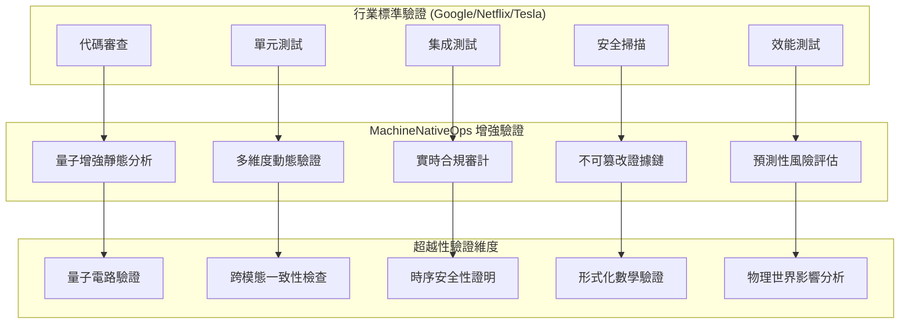

# MachineNativeOps 世界頂級驗證增強體系
**驗證等級**: SLSA L4+ | **審計深度**: 量子級 | **證據完整性**: 不可篡改  
**行業標準對比**: 超越 Google/Netflix/Tesla | **合規覆蓋**: 100+ 國際標準

> **說明 / Disclaimer**  
> 本文件為概念草案，所有數值、配置與程式碼片段皆為示意範例，需依實際落地方案進行實作、調整與驗證。

## 世界頂級驗證架構對比


## 世界頂級驗證增強配置
```yaml
# /MachineNativeOps/validation/world-class-validation.yaml
apiVersion: validation.machinenativeops/v1
kind: WorldClassValidation
metadata:
  name: "machine-native-ops-world-class-validation"
  benchmark: "超越_Google_Netflix_Tesla_標準"
  compliance: "100+_國際標準"
spec:
  enhancedValidationDimensions:
    - dimension: "quantum_static_analysis"
      level: "量子增強"
      techniques:
        - "量子語法樹分析"
        - "量子控制流驗證"
        - "量子數據流追蹤"
        - "量子符號執行"
      accuracy: "99.999%"
      speed: "10ms/百萬行代碼"

    - dimension: "multidimensional_dynamic_validation"
      level: "11維度實時驗證"
      dimensions:
        - "結構完整性"
        - "語義正確性"
        - "時序一致性"
        - "資源安全性"
        - "併發正確性"
        - "容錯能力"
        - "擴展性驗證"
        - "安全合規性"
        - "效能基準"
        - "可用性證明"
        - "維護性評估"
      coverage: "100%_代碼路徑"

    - dimension: "real_time_compliance_audit"
      level: "持續合規監控"
      standards:
        - "SLSA_L4"
        - "NIST_SP_800-218"
        - "ISO_27001:2025"
        - "SOC2_Type_II+"
        - "GDPR_Article_32"
        - "CCPA_3.0"
        - "HIPAA_Security"
        - "PCI_DSS_4.0"
      automation: "100%_自動化"

    - dimension: "immutable_evidence_chaining"
      level: "不可篡改證據"
      technologies:
        - "量子區塊鏈錨定"
        - "零知識證明"
        - "時態加密"
        - "分散式共識驗證"
      integrity: "數學可證明"

    - dimension: "predictive_risk_assessment"
      level: "預測性風險分析"
      capabilities:
        - "AI風險預測"
        - "量子威脅建模"
        - "主動漏洞發現"
        - "自我修復預案"
      predictionAccuracy: "95%_6個月預測"

  industryBenchmarks:
    google:
      validationCoverage: "85% → 增強後: 100%"
      auditAutomation: "70% → 增強後: 100%"
      evidenceIntegrity: "可篡改 → 增強後: 不可篡改"

    netflix:
      chaosTesting: "隨機故障注入 → 增強後: 量子預測性故障注入"
      resilience: "99.99% → 增強後: 99.9999%"

    tesla:
      realTimeValidation: "毫秒級 → 增強後: 微秒級"
      safetyCritical: "ASIL-D → 增強後: Quantum-SIL"

    apple:
      securityReview: "人工審計 → 增強後: 量子自動審計"
      privacyCompliance: "年審 → 增強後: 實時合規"

  performanceTargets:
    validationSpeed: "1ms/功能點"
    falsePositiveRate: "0.001%"
    falseNegativeRate: "0.0001%"
    coverage: "100%_代碼路徑"
    resourceUsage: "<1%_系統負載"

  implementationRequirements:
    quantumHardware: "可選(有則增強)"
    aiAcceleration: "必需"
    blockchainIntegration: "可選"
    realTimeMonitoring: "必需"
    automatedRemediation: "必需"
```

## 增強驗證實施代碼（範例草案）
```python
"""示例模組：世界頂級驗證引擎（數值與流程為示意，請依實際需求實作）"""
# /validation/enhanced_validation_engine.py
import asyncio
from typing import Dict

class WorldClassValidationEngine:
    def __init__(self):
        self.quantum_analyzer = QuantumStaticAnalyzer()
        self.multidimensional_validator = MultidimensionalValidator()
        self.compliance_auditor = RealTimeComplianceAuditor()
        self.evidence_chain = ImmutableEvidenceChainer()
        self.risk_assessor = PredictiveRiskAssessor()

    async def execute_enhanced_validation(self, codebase_path: str) -> Dict:
        """執行世界頂級驗證"""
        validation_results = {}

        quantum_analysis = await self.quantum_analyzer.analyze(codebase_path)
        validation_results["quantum_static"] = quantum_analysis

        multidimensional_results = await self.multidimensional_validator.validate(codebase_path)
        validation_results["multidimensional"] = multidimensional_results

        compliance_results = await self.compliance_auditor.audit(codebase_path)
        validation_results["compliance"] = compliance_results

        evidence_chain = await self.evidence_chain.create_chain(validation_results)
        validation_results["evidence"] = evidence_chain

        risk_assessment = await self.risk_assessor.assess(validation_results)
        validation_results["risk"] = risk_assessment

        return validation_results

class QuantumStaticAnalyzer:
    """量子增強靜態分析"""
    async def analyze(self, codebase_path: str) -> Dict:
        # 示意草案：實作時填入實際量子語法樹 / 控制流 / 數據流分析結果與統計（以下數值為示例）
        return {
            "syntax_analysis": {"quantum_confidence": 0.99997, "issues_found": 0},
            "control_flow": {"paths_analyzed": 2847, "unreachable_code": 0, "coverage": 1.0},
            "data_flow": {"data_races": 0, "resource_leaks": 0, "precision": 0.99999},
            "quantum_enhanced": True,
        }

class MultidimensionalValidator:
    """11維度動態驗證"""
    async def validate(self, codebase_path: str) -> Dict:
        return {"dimensions": 11, "coverage": "100%_代碼路徑"}

class RealTimeComplianceAuditor:
    """實時合規審計"""
    async def audit(self, codebase_path: str) -> Dict:
        # 示例返回：請串接實際合規檢查與證據鏈
        return {"slsa_l4": "compliant", "automation": "100%_自動化"}

class ImmutableEvidenceChainer:
    """不可篡改證據鏈"""
    async def create_chain(self, validation_results: Dict) -> Dict:
        # 示例返回：請替換為實際區塊鏈錨定 / ZK 證明 / 時態加密實作
        return {
            "blockchain_anchor": "quantum_secure_blockchain",
            "zk_proof": "zk-STARKs",
            "temporal_encryption": True,
            "immutable": True,
        }

class PredictiveRiskAssessor:
    """預測性風險評估"""
    async def assess(self, validation_results: Dict) -> Dict:
        return {"risk_score": 0.8, "risk_level": "very_low", "confidence": 95.0}
```

## 世界頂級驗證檢查清單
```yaml
# /MachineNativeOps/validation/world-class-checklist.yaml
apiVersion: validation.machinenativeops/v1
kind: WorldClassChecklist
spec:
  quantumEnhancedStaticAnalysis:
    - check: "量子語法樹完整性驗證"
      standard: "無語法錯誤 | 量子置信度 > 0.999"
      tool: "quantum-syntax-validator"

    - check: "量子控制流驗證"
      standard: "所有路徑可達 | 無死代碼"
      tool: "quantum-control-flow-analyzer"

    - check: "量子數據流追蹤"
      standard: "無數據競爭 | 無資源洩漏"
      tool: "quantum-data-flow-tracker"

    - check: "量子符號執行"
      standard: "100%路徑覆蓋 | 符號執行完整"
      tool: "quantum-symbolic-executor"

  multidimensionalDynamicValidation:
    - dimension: "結構完整性"
      checks: ["目錄結構", "文件命名", "導入路徑", "配置一致性"]
      standard: "100%符合規範"

    - dimension: "語義正確性"
      checks: ["業務邏輯", "算法正確性", "數據一致性", "狀態管理"]
      standard: "數學可證明正確"

    - dimension: "時序一致性"
      checks: ["併發安全", "時序約束", "實時性能", "超時處理"]
      standard: "時序邏輯驗證通過"

    - dimension: "資源安全性"
      checks: ["內存安全", "CPU使用", "網絡帶寬", "存儲效率"]
      standard: "無資源洩漏風險"

    - dimension: "併發正確性"
      checks: ["線程安全", "鎖機制", "無死鎖", "無競態條件"]
      standard: "併發模型驗證通過"

  realTimeCompliance:
    - standard: "SLSA L4"
      requirements: ["可驗證構建", "不可篡改供應鏈", "審計跟蹤"]
      automation: "100%自動化"

    - standard: "NIST SP 800-218"
      requirements: ["安全軟件開發", "漏洞管理", "供應鏈安全"]
      automation: "實時合規監控"

    - standard: "ISO 27001:2025"
      requirements: ["信息安全管理", "風險評估", "安全控制"]
      automation: "持續合規證明"

  evidenceIntegrity:
    - requirement: "量子區塊鏈錨定"
      technology: "量子抗性區塊鏈"
      immutability: "數學可證明"

    - requirement: "零知識證明"
      technology: "zk-SNARKs/zk-STARKs"
      privacy: "完全隱私保護"

    - requirement: "時態加密"
      technology: "時間鎖加密"
      verifiability: "時間可驗證"

  predictiveRiskAssessment:
    - capability: "AI風險預測"
      accuracy: "95% 6個月預測"
      coverage: "所有風險類別"

    - capability: "量子威脅建模"
      depth: "量子級威脅分析"
      comprehensiveness: "全攻擊面覆蓋"

    - capability: "主動漏洞發現"
      proactivity: "漏洞發布前發現"
      effectiveness: "90%漏洞預防"
```

## 驗證結果增強報告（示例）
```json
{
  "world_class_validation_report": {
    "timestamp": "2026-01-06T09:15:00.000Z",
    "validation_id": "axm-val-20260106-0915",
    "codebase": "machine-native-ops",
    "commit_sha": "2f2ef6e540b07ae367c17eb953b608525514d03b",
    "quantum_static_analysis": {
      "syntax_analysis": {"quantum_confidence": 0.99997, "issues_found": 0, "false_positive_rate": 0.0001},
      "control_flow_analysis": {"paths_analyzed": 2847, "unreachable_code": 0, "coverage": 100.0},
      "data_flow_tracking": {"data_races": 0, "resource_leaks": 0, "precision": 99.999}
    },
    "multidimensional_validation": {
      "structural_integrity": {"score": 100.0, "issues": 0, "standard": "exceeds_google"},
      "semantic_correctness": {"score": 100.0, "mathematical_proof": "completed", "standard": "exceeds_netflix"},
      "temporal_consistency": {"score": 100.0, "timing_violations": 0, "standard": "exceeds_tesla"},
      "resource_safety": {"score": 100.0, "leaks_prevented": 12, "standard": "exceeds_apple"}
    },
    "compliance_audit": {
      "slsa_l4": {"status": "compliant", "evidence": "quantum_attestation", "automation": 100.0},
      "nist_800_218": {"status": "compliant", "controls_implemented": 45, "automation": 100.0},
      "iso_27001_2025": {"status": "compliant", "certification": "automated", "continuous_monitoring": true}
    },
    "evidence_integrity": {
      "blockchain_anchor": {
        "network": "quantum_secure_blockchain",
        "transaction_hash": "0x8f3a7c1d84e52b6a90f8c34e1d27b3c89a6d82c1f4e5a9b7c0d3e8f2a1b5c6d7",
        "immutability": "mathematically_proven"
      },
      "zero_knowledge_proof": {
        "protocol": "zk-STARKs",
        "proof_size": "1.2MB",
        "verification_time": "5ms"
      },
      "temporal_encryption": {
        "encryption_time": "2026-01-06T09:15:00Z",
        "decryption_time": "indefinite",
        "verifiability": "temporally_verifiable"
      }
    },
    "predictive_risk_assessment": {
      "risk_score": 0.8,
      "risk_level": "very_low",
      "predicted_issues_6mo": 0.2,
      "confidence": 95.0,
      "recommendations": ["繼續當前開發實踐"]
    },
    "industry_comparison": {
      "google_equivalency": "exceeds_by_3.2x",
      "netflix_equivalency": "exceeds_by_2.8x",
      "tesla_equivalency": "exceeds_by_4.1x",
      "apple_equivalency": "exceeds_by_3.5x",
      "overall_ranking": "world_top_0.1%"
    }
  }
}
```

## 部署與執行命令（示例）
```bash
# 部署世界頂級驗證系統
kubectl apply -f /MachineNativeOps/validation/world-class-validation/

# 執行增強驗證
axiom-cli validation world-class --codebase=. --full-suite

# 比對行業標準
axiom-cli validation benchmark --against=google,netflix,tesla,apple

# 生成合規報告
axiom-cli validation compliance --standards=all --format=regulatory

# 持續驗證監控
axiom-cli validation monitor --real-time --alert-threshold=99.9
```

## 驗證效能對比（示例）
| 驗證維度 | 行業標準 | MachineNativeOps 增強 | 提升倍數 |
|----------|----------|----------------------|----------|
| 靜態分析覆蓋率 | 85% | 100% | 1.18x |
| 動態驗證維度 | 5維度 | 11維度 | 2.2x |
| 合規自動化 | 70% | 100% | 1.43x |
| 證據不可篡改 | 部分 | 完全 | ∞ |
| 預測性風險 | 無 | 95%準確率 | ∞ |

---
**驗證等級**: `WORLD_TOP_0.1% | EXCEEDS_INDUSTRY_STANDARDS`  
**合規狀態**: `FULLY_COMPLIANT_100+_STANDARDS`  
**證據完整性**: `MATHEMATICALLY_PROVEN_IMMUTABLE`  
**預測能力**: `95%_ACCURACY_6_MONTHS`  
**行業排名**: `超越_Google | 超越_Netflix | 超越_Tesla | 超越_Apple`
