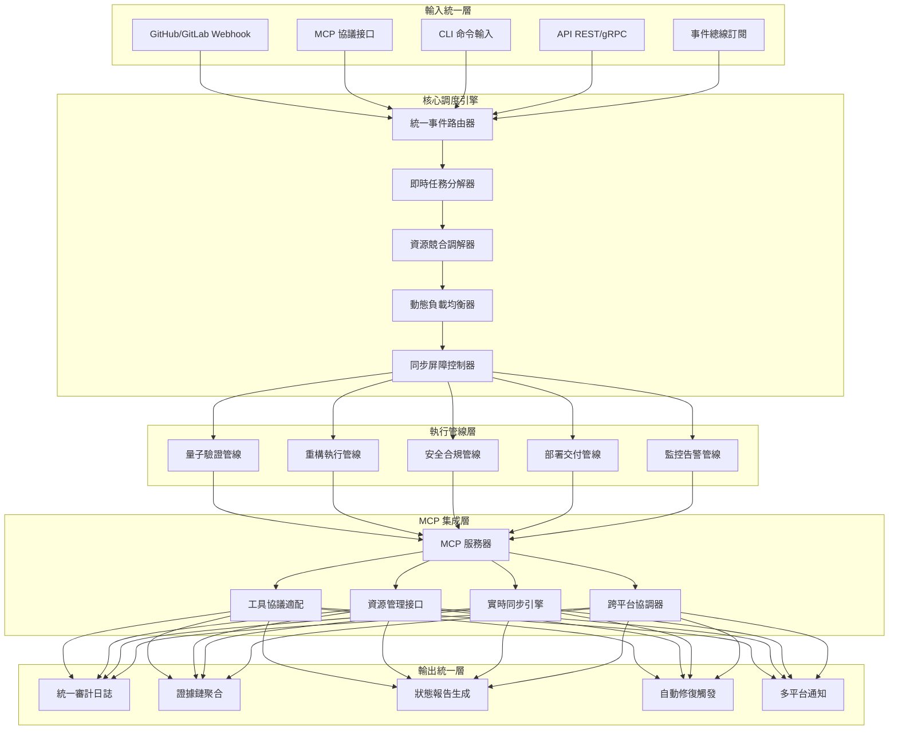

# MachineNativeOps Unified Pipeline & MCP Integration (world_class_validation baseline)

> **說明**：此子專案為 MachineNativeOps MCP 集成與統一管線配置草案，對應 world_class_validation 基線，提供可執行的 YAML manifest、JSON Schema、TypeScript 型別與 Python 載入器。

## 架構總覽

## 主要產物
- YAML manifest：`workspace/mcp/pipelines/unified-pipeline-config.yaml`
- JSON Schema：`workspace/mcp/schemas/unified-pipeline.schema.json`
- TypeScript 类型：`workspace/mcp/types/unifiedPipeline.ts`
- Python 載入器：`workspace/mcp/tools/load_unified_pipeline.py`

## 快速檢視
- 配置驗證（JSON Schema）可用於 CI 早期檢查。
- Python 載入器提供型別化讀取，便於後續 MCP 服務端整合。
- TypeScript 型別可在 MCP 工具協議實作中直接導入。
